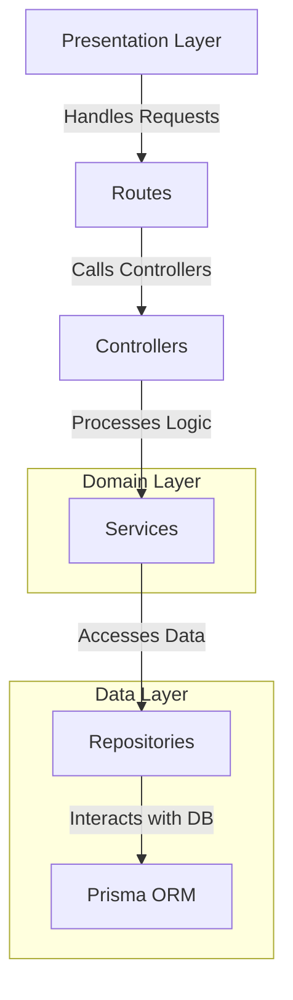
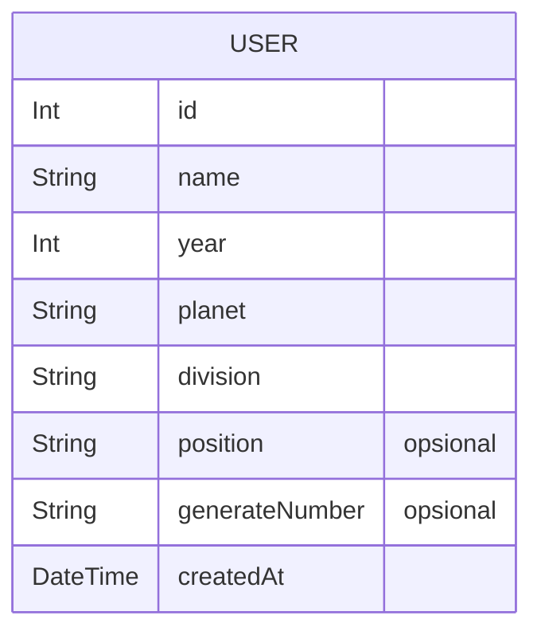

# Skill Test Backend MiniLemon

This is the backend for a note-taking application built with Express.js.

This project follows a clean architecture approach, which aims to separate concerns and create a maintainable and scalable codebase. Here's a brief explanation of the structure:


## Architecture:


### 📁 Project Structure  

This project follows a clean and organized structure, ensuring maintainability and scalability. Below is an overview of the main directories and files:  

### 📂 Root Directories  
- **`api/`** - Entry point for the API, responsible for initializing and configuring the server.  
- **`prisma/`** - Contains database schema and migration files.  
- **`public/`** - Serves static files used by the application.  
- **`src/`** - Main source code directory.  

### 📂 Source Code (`src/`)  
#### 🏗️ Architecture Layers  
- **`controllers/`** - Handles HTTP requests and responses.  
- **`routes/`** - Defines API endpoints and connects them to controllers.  
- **`services/`** - Contains business logic and core application functionality.  
- **`repositories/`** - Manages database operations and interactions.  
- **`models/`** - Defines data structures and database models.  

#### 🔧 Supporting Modules   
- **`utils/`** - Utility functions to support the application.  
- **`types/`** - TypeScript type definitions for better type safety.  

## 🛠️ Configuration Files  
- **`package.json`** - Project manifest file.
- **`tsconfig.json`** - TypeScript configuration file.  
- **`vercel.json`** - Configuration for deployment on Vercel.  

## 📚 API Documentation

<details>
<summary><code>POST /users</code> - <strong>Create a New Generate Code</strong></summary>

-   **Description:** Registers a new user in the system.

-   **Request Body (`application/json`)**
    ```json
    {
      "name": "Jane Doe",
      "year": 25,
      "planet": "Minilemon Technology",
      "division": "Web Developer",
      "position": "Back-End Web Developer"
    }
    ```
-   **Example Success Response (`201 Created`)**
    ```json
    {
      "success": true,
      "message": "Success Generate Number",
      "data": {
        "id": 1,
        "name": "Jane Doe",
        "year": 25,
        "planet": "Minilemon Technology",
        "division": "Web Developer",
        "position": "Back-End Web Developer",
        "generateNumber": "25030001", 
        "createdAt": "2025-07-08T10:05:00.000Z"
      }
    }
    ```
-   **Example Error Response (`400`/`500`)**
    ```json
    {
      "success": false,
      "message": "Error message description."
    }
    ```
</details>

## Getting Started

### Prerequisites

- Node.js
- npm

### Installation

1. Clone the repository:

```sh
git clone https://github.com/christian-siahaan26/generate-nism-ml
```

2. Navigate to the project directory:

```sh
cd generate-nism-minilemon
```

3. Install dependencies:

```sh
npm install
```

### Database Setup

#### ERD



1. Migrate prisma database:

```sh
npx prisma migrate dev
```

### Running the Server

1. Start the development server:

```sh
npm run dev
```

## Contributing

Contributions are welcome! Please open an issue or submit a pull request.

## License

This project is licensed under the MIT License.
